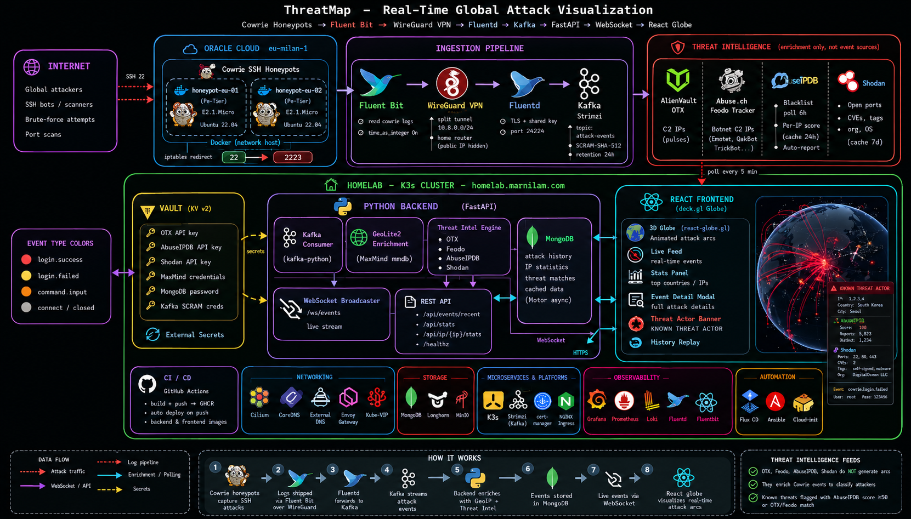
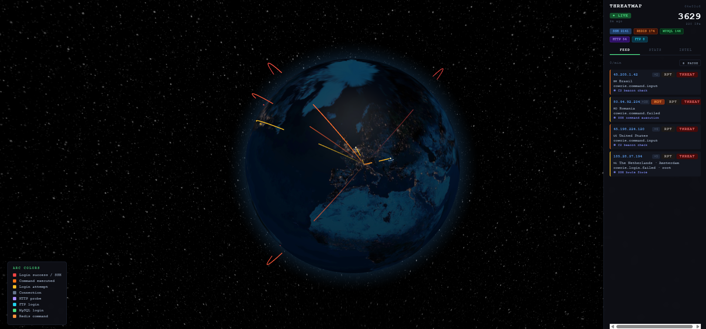
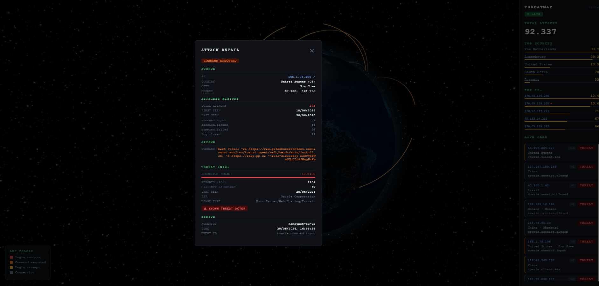

# ThreatMap

Real-time global attack visualization - SSH honeypots on Oracle Cloud feed live attack events, enriched with geolocation and threat intelligence, and rendered as animated arcs on a 3D globe.



## Screenshots





---

## What it does

- Cowrie SSH+Telnet honeypots and OpenCanary (HTTP/FTP/MySQL) on Oracle Cloud (eu-milan-1) capture real attacks from the internet
- Events stream over WireGuard VPN → Fluentd → Kafka
- Python backend enriches each event with MaxMind GeoLite2 (country, city, lat/lon), Shodan (open ports, CVEs, tags, org), and cross-references AlienVault OTX + Abuse.ch + AbuseIPDB threat feeds
- React frontend renders animated attack arcs on a 3D globe in real time via WebSocket, with floating country/city labels at attack origins
- Arc and point colors coded by event type: login.success=red, login.failed=amber, command.input=orange, connect=grey, http=purple, ftp=cyan, mysql=green
- Hourly bar chart in the stats panel shows attack volume over the last 24 hours
- Known threat IPs (AbuseIPDB score ≥50 or OTX/Feodo match) flagged with KNOWN THREAT ACTOR banner + intel source name in detail modal
- Returning attackers flagged with RPT badge in the live feed (in-session detection)
- Credentials leaderboard shows top usernames and passwords tried across all attacks
- Top commands section shows most common shell commands executed by attackers
- Sensor breakdown shows per-honeypot attack counts; protocol split shows SSH vs Telnet totals
- Click any event in the live feed for full attack detail (credentials attempted, honeypot sensor, geo coords)

---

## Stack

| Layer | Technology |
|---|---|
| Honeypots | Cowrie SSH+Telnet + OpenCanary HTTP/FTP/MySQL (Docker, `--network host`) on Oracle Cloud E2.1.Micro |
| Log shipping | Fluent-Bit → WireGuard VPN → Fluentd → Kafka (Strimzi) |
| Backend | Python 3.12, FastAPI, kafka-python, Motor (MongoDB), httpx |
| Geolocation | MaxMind GeoLite2 City (local `.mmdb`, downloaded at pod start) |
| Threat intel | AlienVault OTX + Abuse.ch Feodo Tracker (polled every 5 min) + AbuseIPDB (per-IP check with 24h cache, blacklist polled every 6h, auto-reports attackers) |
| Host intel | Shodan (open ports, CVEs, tags, org, OS - per-IP with 7-day cache, Membership plan) |
| Frontend | React 18, react-globe.gl, Vite |
| Persistence | MongoDB |

---

## Repo structure

```
threatmap/
├── backend/
│   ├── main.py              FastAPI app, WebSocket broadcaster, REST endpoints
│   ├── kafka_consumer.py    Kafka consumer, GeoIP enrichment, MongoDB persistence
│   ├── geoip.py             MaxMind GeoLite2 wrapper
│   ├── otx_poller.py        OTX + Feodo + AbuseIPDB blacklist poller; per-IP AbuseIPDB check (24h cache); Shodan host lookup (7d cache); auto-reports attackers
│   ├── db.py                Async MongoDB connection (Motor)
│   ├── requirements.txt
│   └── Dockerfile
├── frontend/
│   ├── src/
│   │   ├── App.jsx              Root component, WebSocket state, history loader
│   │   ├── components/
│   │   │   ├── GlobeMap.jsx     react-globe.gl 3D globe with arc + point layers
│   │   │   ├── StatsPanel.jsx   Live feed, top countries, total counter
│   │   │   └── EventDetail.jsx  Click-to-expand modal with full attack detail
│   │   └── hooks/
│   │       ├── useWebSocket.js  Auto-reconnecting WebSocket hook
│   │       └── useWindowSize.js Reactive window dimensions + isMobile flag (< 768px)
│   ├── index.html
│   ├── vite.config.js
│   ├── nginx.conf
│   └── Dockerfile
├── docs/
│   ├── honeypot-setup.md    Full VM setup guide (WireGuard, Cowrie, Fluent-Bit)
│   └── threatmap-architecture.png
└── .github/workflows/
    └── ci.yml               Build + push backend and frontend to GHCR on push to main
```

---

## Backend environment variables

| Variable | Default | Description |
|---|---|---|
| `KAFKA_BOOTSTRAP` | `kafka-kafka-bootstrap.kafka.svc.cluster.local:9092` | Kafka bootstrap servers |
| `KAFKA_TOPIC` | `attack-events` | Topic to consume |
| `KAFKA_SECURITY_PROTOCOL` | `PLAINTEXT` | `SASL_PLAINTEXT` or `SASL_SSL` for auth |
| `KAFKA_SASL_MECHANISM` | - | `SCRAM-SHA-512` when using SASL |
| `KAFKA_USERNAME` | - | Kafka SCRAM username |
| `KAFKA_PASSWORD` | - | Kafka SCRAM password |
| `MONGO_URI` | `mongodb://localhost:27017` | MongoDB connection string |
| `MONGO_DB` | `threatmap` | Database name |
| `GEOIP_DB_PATH` | `/data/GeoLite2-City.mmdb` | Path to MaxMind mmdb file |
| `OTX_API_KEY` | - | AlienVault OTX API key (optional, enriches known-threat flags) |
| `ABUSEIPDB_API_KEY` | - | AbuseIPDB API key - per-IP confidence score, score ≥50 sets known_threat=true |
| `SHODAN_API_KEY` | - | Shodan Membership API key - per-IP host data (ports, CVEs, tags, org); 7-day cache to stay within 100 credits/month |
| `HOME_LAT` | `45.4654` | Destination latitude (arc endpoint on the globe) |
| `HOME_LON` | `9.1859` | Destination longitude (arc endpoint on the globe) |

---

## Frontend environment variables

| Variable | Default | Description |
|---|---|---|
| `VITE_WS_URL` | auto-detected from `window.location` | WebSocket URL override |

---

## Threat intelligence - how it works

**Important:** OTX, Feodo, and AbuseIPDB are **enrichment feeds, not event sources**. They do not generate arcs on the globe. The only event source is the Cowrie honeypots - an arc appears only when a real SSH connection hits them.

The feeds act as lookup tables to classify attackers:

| Feed | What it contains | How it appears in the UI |
|---|---|---|
| **AlienVault OTX** | C2 server IPs from subscribed threat intel pulses | `known_threat=true` → red dot + KNOWN THREAT banner, *only if that IP also attacks the honeypot* |
| **Abuse.ch Feodo Tracker** | Botnet C2 IPs (Emotet, QakBot, TrickBot) | Same as OTX |
| **AbuseIPDB blacklist** | High-confidence (≥90%) reported abuser IPs, polled every 6h | Same - flags IP as known threat |
| **AbuseIPDB check (per-IP)** | Real-time reputation score for each attacker IP | Score bar, total reports, distinct reporters, ISP in the detail modal |
| **AbuseIPDB report** | Auto-reports each attacker back to the community | No UI effect - contributes to the public blocklist |
| **Shodan** | Open ports, known CVEs, tags (malware/tor/self-signed/etc.), org, OS, hostname for each attacker IP | SHODAN section in detail modal; 7-day per-IP cache (Membership = 100 credits/month) |

OTX and Feodo focus on C2 infrastructure; AbuseIPDB covers a broader range of attack patterns and tends to produce the most matches against honeypot traffic.

---

## Vault secrets

All secrets are stored in HashiCorp Vault (KV v2 mount: `secret/`) and synced to Kubernetes via ExternalSecrets. Populated by `ansible/tasks/load_threatmap_credentials_into_vault.yml` (Stage 5 playbook).

| Vault path | Keys | Description |
|---|---|---|
| `secret/threatmap/otx` | `otx_api_key` | AlienVault OTX API key (otx.alienvault.com) |
| `secret/threatmap/abuseipdb` | `api_key` | AbuseIPDB API key (abuseipdb.com → API) |
| `secret/threatmap/shodan` | `api_key` | Shodan Membership API key (account.shodan.io) |
| `secret/threatmap/maxmind` | `license_key`, `account_id` | MaxMind account credentials for GeoLite2 download |
| `secret/threatmap/mongodb` | `password` | MongoDB `threatmap` user password (auto-generated if absent) |
| `secret/kafka/threatmap` | `username`, `password` | Kafka SCRAM-SHA-512 credentials for consumer + producer (auto-generated if absent) |

The `kafka/threatmap` password is also written to the Kubernetes secret `threatmap-backend-kafka-secret` in the `kafka` namespace, which Strimzi reads to provision the `threatmap-backend` KafkaUser.

The Stage 5 Ansible playbook is Vault-first: it checks each secret in Vault and only prompts interactively if the key is not found. MongoDB and Kafka passwords are auto-generated on first run and preserved on subsequent runs. No credentials file is needed.

---

## API

| Endpoint | Description |
|---|---|
| `GET /api/events/recent?limit=200` | Last N enriched attack events from MongoDB |
| `GET /api/stats` | Total count + top 10 countries/IPs + protocol breakdown + honeypot breakdown |
| `GET /api/stats/hourly` | Attack count per hour for the last 24 hours (used by bar chart) |
| `GET /api/stats/credentials` | Top 10 usernames and top 10 passwords tried across all attacks |
| `GET /api/stats/commands` | Top 10 shell commands executed in `cowrie.command.input` events |
| `GET /api/ip/{ip}/stats` | Per-IP history: total attacks, first/last seen, event type breakdown |
| `WS /ws/events` | Live event stream (JSON, one event per message) |
| `GET /healthz` | Liveness probe |

### Event schema

Each event (WebSocket or REST) contains:

```json
{
  "timestamp": "2026-06-18T06:00:00Z",
  "src_ip": "1.2.3.4",
  "src_lat": 37.5,
  "src_lon": 127.0,
  "src_country": "South Korea",
  "src_country_code": "KR",
  "src_city": "Seoul",
  "dst_lat": 45.4654,
  "dst_lon": 9.1859,
  "event_type": "cowrie.login.failed",
  "username": "root",
  "password": "123456",
  "honeypot": "honeypot-eu-01",
  "protocol": "ssh",
  "command": "cat /etc/passwd",
  "duration": 4.2,
  "known_threat": true,
  "abuse_score": 100,
  "abuse_total_reports": 5823,
  "abuse_distinct_users": 1234,
  "abuse_last_reported": "2026-06-20T08:00:00+00:00",
  "abuse_isp": "Consortium GARR",
  "abuse_usage_type": "Data Center/Web Hosting/Transit",
  "abuse_is_tor": false,
  "shodan_ports": [22, 80, 443],
  "shodan_tags": ["self-signed", "malware"],
  "shodan_vulns": ["CVE-2021-44228", "CVE-2017-0144"],
  "shodan_org": "DigitalOcean LLC",
  "shodan_hostnames": ["scanner.example.com"],
  "shodan_os": null,
  "shodan_last_update": "2026-06-15T12:00:00",
  "threat_source": "Feodo Tracker",
  "is_returning": true,
  "previous_count": 14
}
```

### Event type color scheme

| `event_type` | Arc color | Meaning |
|---|---|---|
| `cowrie.login.success` | Red | Attacker got past authentication |
| `cowrie.login.failed` | Amber | Brute-force attempt |
| `cowrie.command.input` | Orange | Active session, commands executed |
| `cowrie.session.connect` / `cowrie.session.closed` | Grey | Connection noise, not interesting |
| `opencanary.http.request` | Purple | HTTP probe against fake NAS login page |
| `opencanary.ftp.login` | Cyan | FTP login attempt |
| `opencanary.mysql.login` | Green | MySQL login attempt |

---

## Honeypot setup

See [docs/honeypot-setup.md](docs/honeypot-setup.md) for the full guide covering:
- Oracle Cloud VM provisioning
- WireGuard VPN tunnel setup
- SSH port migration (real SSH → 2222, Cowrie → 2223 via iptables redirect)
- Cowrie Docker setup with named volume and custom config
- Fluent-Bit configuration (TLS + shared key auth to Fluentd)
- End-to-end pipeline verification

**Critical Fluent-Bit setting:** the Forward output to Fluentd must include `time_as_integer On`. Without it, Fluent-Bit sends timestamps as msgpack `EventTime` extension objects which Fluentd rejects with `skip invalid event`, silently dropping all events.

```ini
[OUTPUT]
    Name          forward
    Match         cowrie
    Host          <fluentd-ip>
    Port          24224
    Shared_Key    <shared-key>
    tls           On
    tls.verify    Off
    time_as_integer On
```

---

## Images

Published to GHCR on every push to `main`:

```
ghcr.io/marmila/threatmap-backend:latest
ghcr.io/marmila/threatmap-frontend:latest
```
